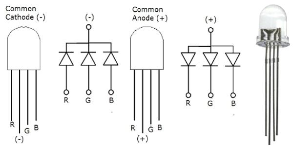

# CircuitPython

## LCD_button
this is the button code for the LCD button. If not var count variable. button state is off for max value and on for 0 value. (pressed down)
### notes
the button needs to be delicatly wired. in count does not increase, press button again or check wires. The LCD backpack needs a refresh statement after every press, but the stament should hold until pressed again.

## ServoTouch
this is the constant servo assignment with the if then hold statement. 
### notes
Touching one wire creates a deficit in the power value of one PWM obj. and a less than value moves the servo left or right. both wires must not touch eachother for the code to work.

## Blink
this is the fading led with the value ceilings. 
### notes
Value for LEDs does not show untill above 20k - 50k.
Simple LED.

## distance sensor
Used the if not find x equations.
### notes
A distance from 5-20CM shows up as a green light on the metro board, past 20cm it is blue and past 35cm it turns red.
the distance sensor is accurate when moved at a relatively slow pace. 

Make sure that all LEDs are wired correctly, long leg takes power/short to ground!
True false variable used for turning the LEDs on and off.

## Hello VS code
prints a message every second in the console.
### notes

